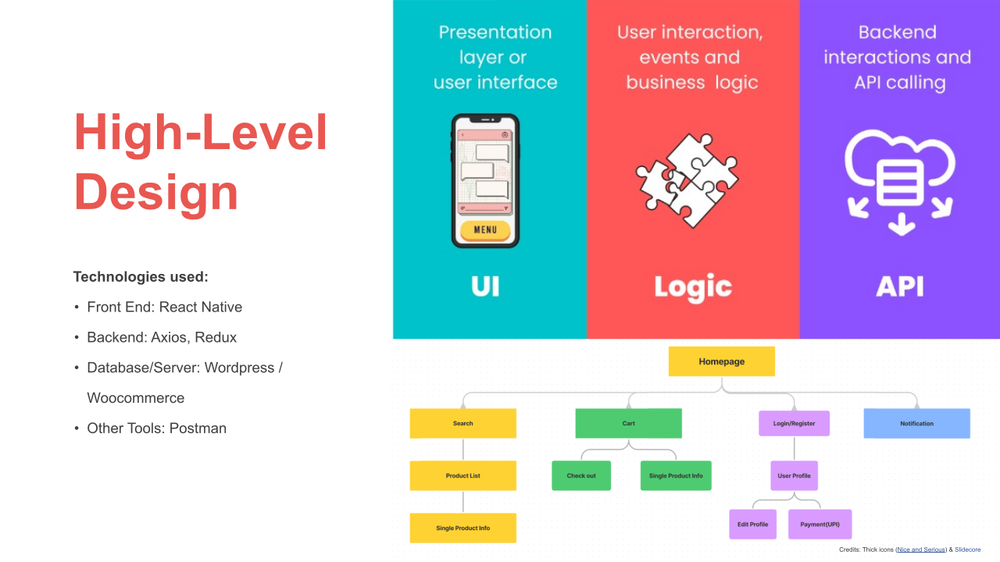
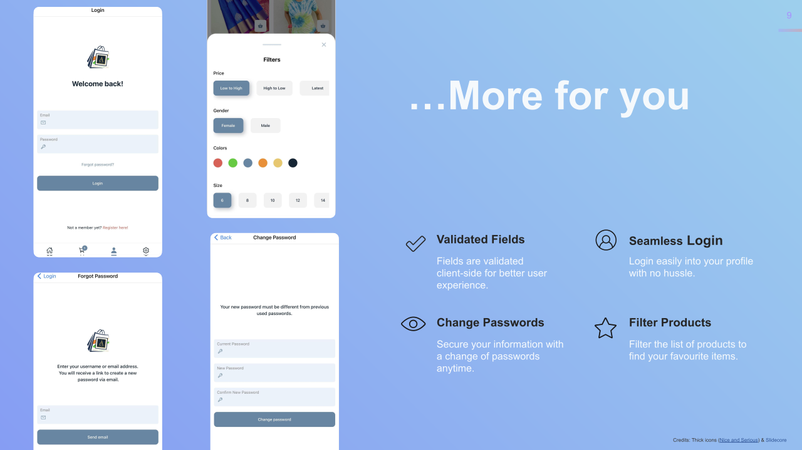

# ArtNBuff
Ecommerce application

## Project Description
InnC LLC is an eCommerce company that enables the buying and selling of merchandise between producers and consumers through its eCommerce website. As part of the expansion, the company is looking to develop an  iOS and Android mobile application for its eCommerce platform. 

Artnbuff Shopping Mobile App is an iOS and Android application designed for this expansion. The Artnbuff app is equipped with various e-commerce features, including a homepage, search bar, user profile, products page, settings page, filtering, sorting, checkout, and wishlist. Moreover, it provides vendor details for products listed by vendors who are registered on the platform. The app boasts an exceptional and unique design, considered one of the best in the market.

Artnbuff Shopping Mobile App was created to address the problem of making Indian art and craft easily accessible to Indian art lovers all over the world. Specifically, it tackles issues such as the restricted entry of Indian artists and artisans into global markets, the challenge for customers to find genuine products made in India and the necessity for a centralized platform that can endorse and provide assistance to Indian artists and crafters.

### Screenshots

bring images that are in the screenshots folder of extension .svg

